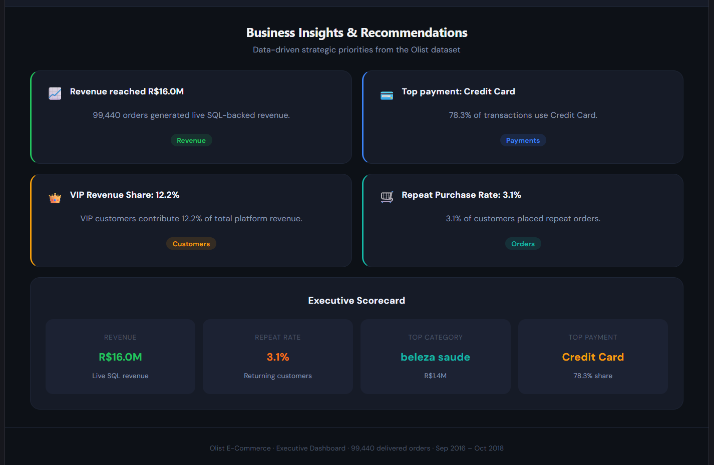

🚀 CommerceMind AI — E-Commerce Executive Intelligence Dashboard

A full-stack AI-powered e-commerce analytics platform built using FastAPI, MySQL, React, and advanced SQL.
This project transforms raw Olist marketplace data into actionable executive insights through interactive dashboards, live KPIs, customer analytics, product intelligence, and business recommendations.

🌐 Live Demo
Frontend (Vercel)

CommerceMind AI Dashboard

Backend API (Render)

FastAPI Backend

API Documentation

Swagger Docs

📌 Project Overview

CommerceMind AI simulates a real-world executive analytics platform used by modern e-commerce companies.

The dashboard provides:

📈 Revenue intelligence
👥 Customer segmentation
🛒 Product performance analytics
💳 Payment behavior insights
🔥 Business KPI tracking
🤖 AI-powered business recommendations
🎛 Interactive slicers and filters
⚡ Live SQL-backed analytics APIs
🛠 Tech Stack
Frontend
React.js
Vite
Recharts
JavaScript
CSS3
Backend
FastAPI
SQLAlchemy
MySQL
Pandas
Database
MySQL (Railway Cloud Database)
Deployment
Vercel (Frontend)
Render (Backend)
Railway (Cloud MySQL)
✨ Features
📊 Executive Dashboard
Total Revenue KPI
Orders KPI
Average Order Value
Review Score Analytics
Peak Sales Month Detection
📈 Revenue Analytics
Monthly Revenue Trends
Revenue by Category
Payment Method Analysis
Dynamic Revenue Filtering
👥 Customer Analytics
Customer Segmentation
VIP Customer Detection
Repeat Purchase Analysis
Retention Insights
🛒 Product Analytics
Top Performing Categories
Monthly Category Growth
Product Performance Tracking
🤖 AI Business Insights
Executive Scorecards
Revenue Recommendations
Customer Retention Insights
Payment Optimization Suggestions
🎛 Interactive Filtering
Year Filters
Payment Filters
Product Category Filters
Customer Segment Filters
🧠 Advanced SQL Concepts Used
CTEs
Window Functions
Aggregations
Ranking Functions
Joins
CASE WHEN
Customer Segmentation Logic
Revenue Cohort Analysis
Repeat Purchase Analysis
📂 Project Structure
CommerceMind-AI/
│
├── backend/
│   ├── main.py
│   ├── services.py
│   ├── analytics.py
│   ├── ai_insights.py
│   ├── database.py
│   └── load_to_mysql.py
│
├── frontend/
│   ├── src/
│   │   ├── Dashboard.jsx
│   │   ├── App.jsx
│   │   └── main.jsx
│   │
│   └── public/
│
├── datasets/
│
├── screenshots/
│
└── README.md
📸 Dashboard Screenshots
🏠 Executive Overview

📈 Revenue Analytics

👥 Customer Analytics

🛒 Product Analytics

🤖 Business Insights

⚙️ Installation & Setup
1️⃣ Clone Repository
git clone https://github.com/YOUR_USERNAME/CommerceMind-AI.git
cd CommerceMind-AI
🔹 Backend Setup
Install Dependencies
pip install -r requirements.txt
Run Backend
uvicorn main:app --reload

Backend runs at:

http://127.0.0.1:8000
🔹 Frontend Setup
Install Dependencies
npm install
Start Frontend
npm run dev

Frontend runs at:

http://localhost:5173
🔌 API Endpoints
Endpoint	Description
/kpis	Dashboard KPIs
/monthly-revenue	Monthly revenue trend
/category-revenue	Revenue by category
/payment-analysis	Payment breakdown
/customer-segments	Customer segmentation
/repeat-customers	Repeat purchase analysis
/monthly-category-revenue	Monthly category performance
/ai-insights	AI-generated recommendations
📊 Dataset

This project uses the publicly available Brazilian Olist E-Commerce Dataset.

Dataset includes:

Orders
Customers
Payments
Products
Reviews
Sellers
🚀 Deployment Architecture
Service	Platform
Frontend	Vercel
Backend API	Render
Database	Railway MySQL
💡 Key Business Insights Generated
Credit Card dominates payment ecosystem
VIP customers contribute disproportionately high revenue
Repeat purchase rate reveals retention opportunities
Beauty & Health category drives highest revenue
Revenue accelerated significantly during late 2017
📈 Future Improvements
AI chatbot integration
Predictive sales forecasting
Real-time streaming analytics
User authentication
Exportable reports
Advanced ML recommendation engine
👩‍💻 Author
Sanjana S

Aspiring Data Analyst & Full Stack Analytics Developer

SQL
Python
FastAPI
React
Data Visualization
Business Analytics
⭐ If You Like This Project

Give this repository a ⭐ on GitHub!